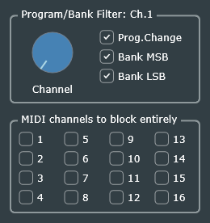

# MIDI Channel Filter
This MIDI-effect can filter out selected MIDI messages, passing only those sent on a specified MIDI channel. All other MIDI messages pass through.

The current version of this effect can filter three kinds of MIDI messages, selected by checkboxes in the graphical user interface (GUI) shown in the screenshot below:

- Program Change
- Bank-Select MSB (CC#0)
- Bank-Select LSB (CC#32)

Each message type is only filtered if the corresponding checkbox is checked; otherwise it is allowed through. For example, if only *Program Change* is checked and *MIDI Channel* is set to 5:

- Incoming MIDI program-change messages will only pass through if they are sent on MIDI channel 5; program-change messages on any other channel will be blocked.
- All other MIDI messages (sent on any MIDI channel) will pass through.

### User Interface

At the top of the GUI, there is a slider to select the desired MIDI channel from 1 to 16.

### Parameters

- **MIDI Channel** may be set to 1 through 16. This is the channel-number which selected messages must match in order to be allowed through.
- **Program Change**, **Bank Select MSB**, and **Bank Select LSB** are Boolean parameters, which correspond to the three checkboxes in the GUI. If the parameter value is greater than or equal to 0.5, the checkbox will be checked, and the selected MIDI messages will be filtered based on the selected MIDI channel.

### Extending to other MIDI message types

Extending this code to support additional MIDI message types should be straightforward.

