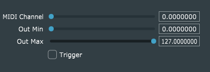

# MIDI PC Randomizer
This MIDI-effect listens for MIDI program-change (PC) messages, and outputs a modified version of each, whose actual program-number is randomly selected within a user-specified range. All other MIDI messages pass through unmodified.

The GUI provides three sliders:

### Parameters

- **MIDI Channel** may be set to 0 through 16. If the value is 0, the plug-in listens for MIDI PC messages on all MIDI channels. Otherwise, it listens only on the specified channel.
- **Out Min** and **Out Max** define the range of output program-numbers, from which a random number is selected in response to each input PC message.

### Notes

- If **MIDI Channel** is non-zero, the plug-in will filter out ALL MIDI messages (not just PC messages) on any other channel.
- The output MIDI PC messages are sent on the same MIDI channel as the input messages. In effect, the program-number of each input MIDI PC message is randomized, and everything else is unchanged.

